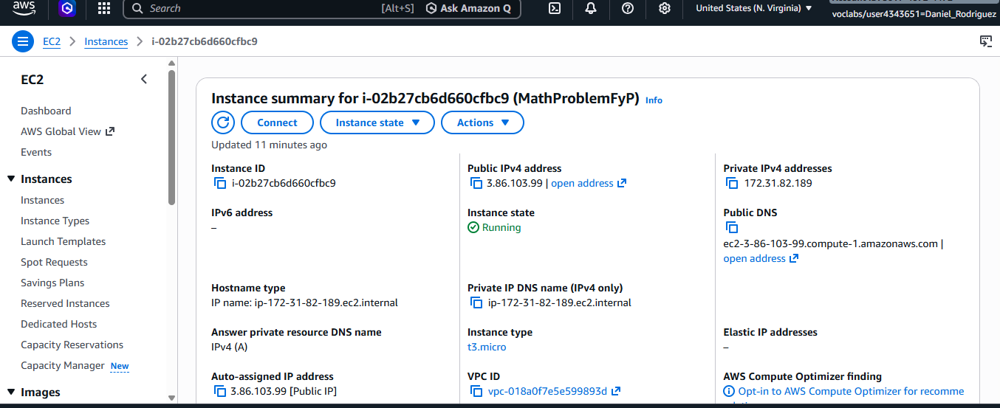
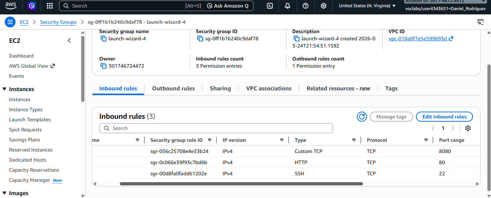
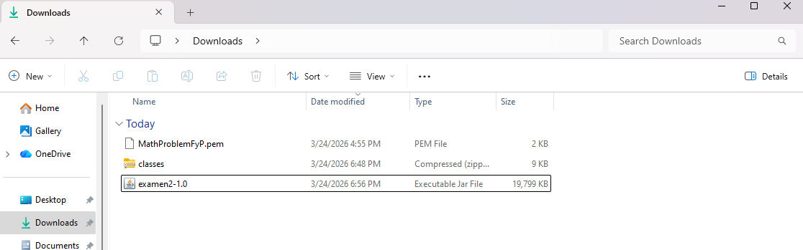
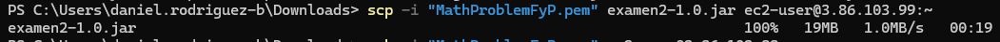
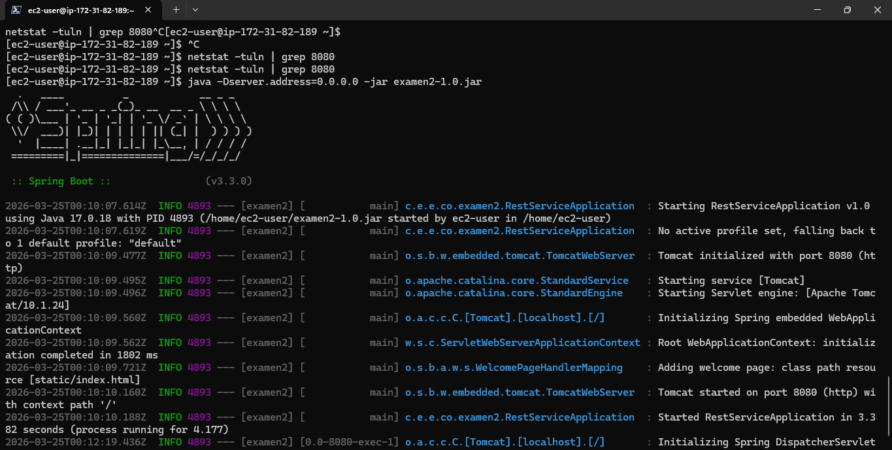
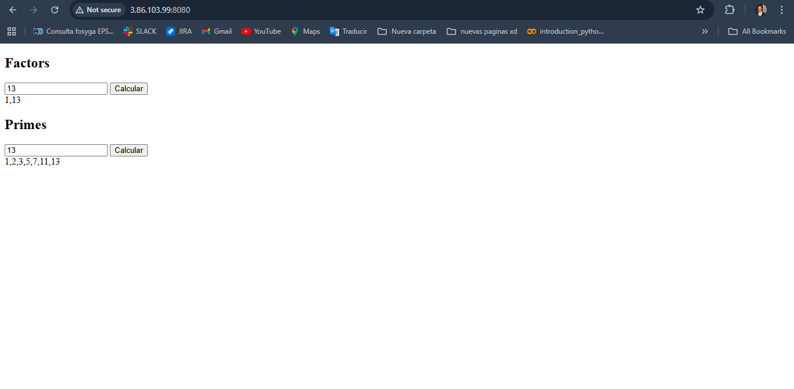

# Daniel_Rodriguez_Examen_2_AREP
# PROBLEMA MATEMATICO Factores y Primos

## Condiciones
Sus servicios matemáticos deben incluir dos funciones. 
Una para calcular los factores de un número: factors(n) retorna un json con una lista de números enteros positivos. (Recibe solo enteros positivos)
Una para calcular los números primos hasta un número dado: primes(n), retorna en un json los números primos menores o iguales a n.

## Requisitos implementacion
PARA AMBAS IMPLEMENTACIONES USE UN ALGORITMO  DE FUERZA BRUTA, ES DECIR, EXPLORE CADA UNO DE LOS VALORES. Usted debe implemntar las dos funciones, no debe usar funciones de una librería o del API (si ya existen).
 
## Outputs

Por ejemplo, para un  número dado n los factores se pueden calcular así:
1 es un factor de todos los números
De ahí en adelante, simplemente mirando el módulo, puede verificar si es o no factor.
Puede mirar todos los numeros hasta n/2
n pertenece también a los factores.
Para los primos, puede usar su función de factores así:

1 es un número primo
de ahí en adelante recuerde que un número es primo si solo es divisible por 1 y por si mismo.
Es decir, un número es primo si el tamaño del conjunto de factores es 2.

Dato: Asegúrese que sus funciones sirven cuando el parámetro es 1.

### etalles adicionales de la arquitectura y del API
Implemente los servicios para responder al método de solicitud HTTP GET. Deben usar el nombre de la función especificado y el parámetro debe ser pasado en la variable de query con el nombre "value".
 
Ejemplo 1 de un llamado:
 
EC2
https://amazonxxx.x.xxx.x.xxx:{port}/factors?value=13

Ejemplo 1 de un llamado:
 
EC2
https://amazonxxx.x.xxx.x.xxx:{port}/factors?value=13
 
Salida. El formato de la salida y la respuesta debe ser un JSON con el siguiente formato
 
{
 "operation": "factors",
 "input":  15,
 "output":  "1,3,5,15"
}
 

## Solucion para el despliegue

- Se creo una instancia EC2 en aws

- Se configuri el Security Groups de la instancia, donde se habrieron lso puestos el 8080 para el Proxy y el 22 para ssh.

- Dentro del repositorio se genero el jar haciendo mvn clean package  y ese se mando hacia la instancia con el comando:
    scp -i "MathProblemFyP.pem" examen2-1.0.jar ec2-user@3.86.103.99:~

    

    

- corremos el jar haciendo java -Dserver.address=0.0.0.0 -jar examen2-1.0.jar

- colocamos como url https y usamos la ip publica de laE EC2 junto all puerto

